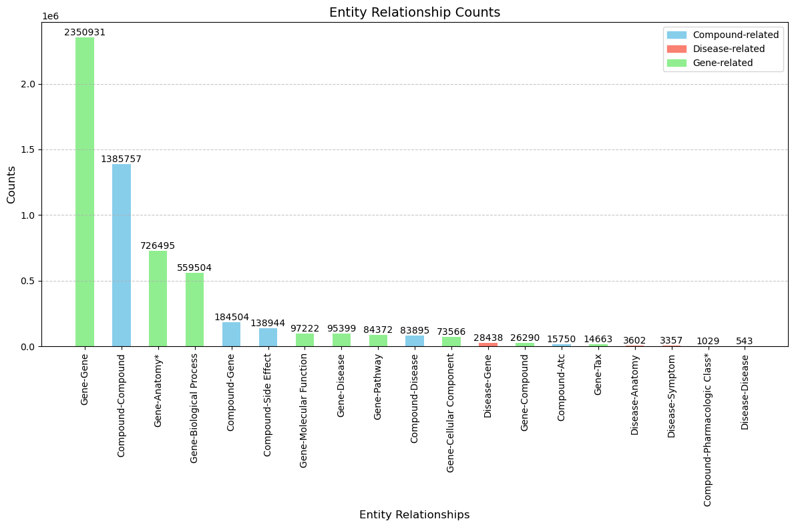
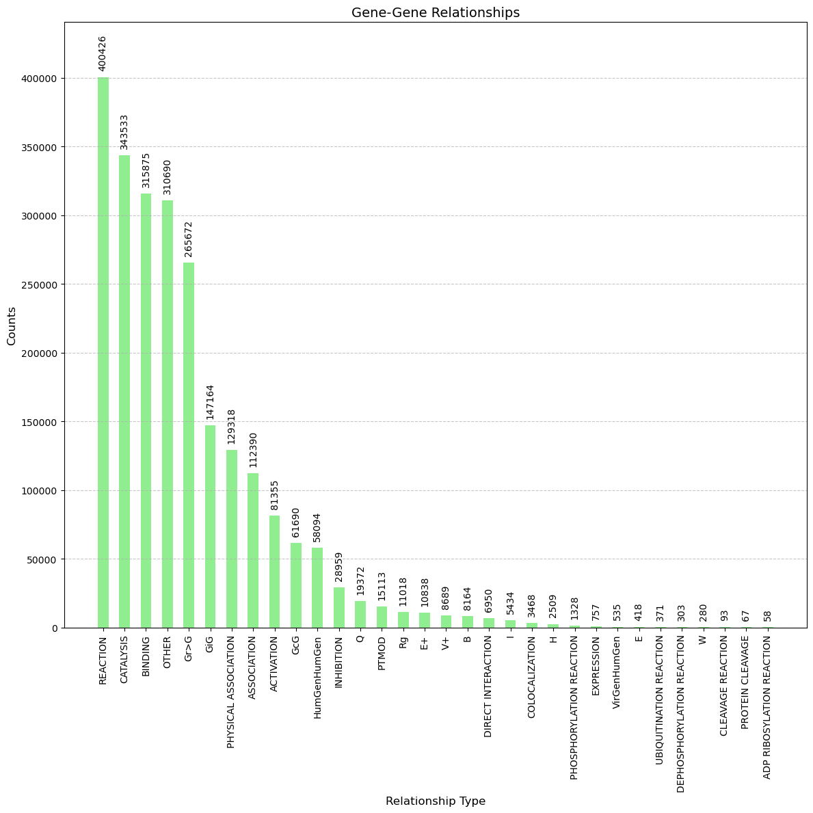
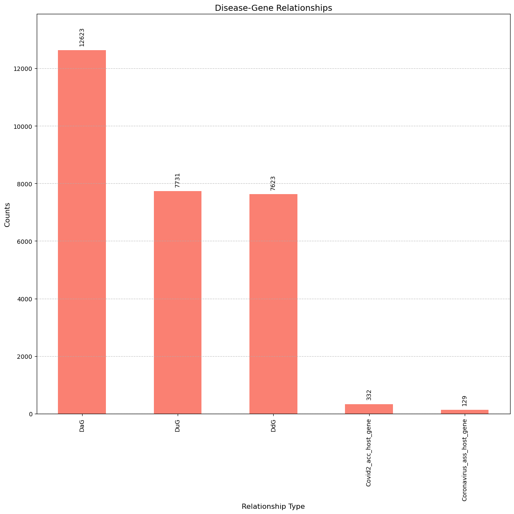
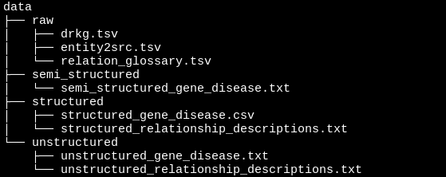
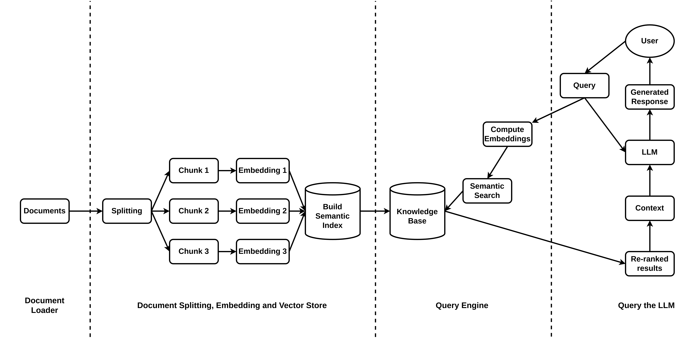

**Authors:** Fuad Al Abir and Akhil Goparaju

Department of Computer Science, College of Arts and Sciences, University of Alabama at Birmingham, AL 35205, USA.

## Overview Poster

[poster](https://docs.google.com/presentation/d/1TqFsUlxZ4UDE_U7msfN02VKIN-2NIdryvsvgmEvkOTo/edit?usp=sharing)


## Dataset Description
We have used the [**Drug Repurposing Knowledge Graph (DRKG)**](https://github.com/gnn4dr/DRKG) dataset for the project. DRKG is a comprehensive biological knowledge graph relating genes, compounds, diseases, biological processes, side effects and symptoms. DRKG includes information from six existing databases including DrugBank, Hetionet, GNBR, String, IntAct and DGIdb. It includes **97,238 entities** belonging to **13 entity-types**; and **5,874,261 triplets** belonging to **107 edge-types**. These 107 edge-types show a type of interaction between one of the 17 entity-type pairs (multiple types of interactions are possible between the same entity-pair), as depicted in the figure below.


## Project Objective

To build **[synergized KG-LLM](https://arxiv.org/pdf/2306.08302.pdf)** that can advance the state-of-the-art drug discovery process, our project aimed to build a prototype with [**Retrieval Augmented Generation (RAG)**](https://research.ibm.com/blog/retrieval-augmented-generation-RAG) on [**Knowledge Graphs (KG)**](https://www.ibm.com/topics/knowledge-graph), harnessing the power of **open-source Large Language Models (LLMs)**.

## Project Structure

**Dataset:** We kept all our raw and processed datasets in **`data/`** directory.

As the raw dataset is huge (and github only can handle ~100MB files), we have to download it from the source and then place it into **`data/raw`** folder.

```bash
wget https://dgl-data.s3-us-west-2.amazonaws.com/dataset/DRKG/drkg.tar.gz
tar -zxvf drkg.tar.gz
mv *tsv data/raw
```

**Notebook:** All the notebooks are located in the **`notebook/`** folder.

**Library Requirements**: All the packages and their versions are listed in `requirements.txt`. Run the following command to install all the packages altogether.


``` bash
pip install -r requirements.txt
```

**Run Instructions:** We have implemented the RAG system using the instruction-tuned [**`Writer/camel-5b-hf`**](https://huggingface.co/Writer/camel-5b-hf) model which approximately requires **` 25GB GPU memory`** for inference. Therefore a **`amperenodes`** from Cheaha with **`one A100 GPU`** is sufficient.

> [!CAUTION]
> Our code may not be compatible with multi-gpu nodes from Cheaha.

## Exploratory Data Analysis (EDA)

**Notebook:** `notebook/0_exploratory_data_analysis.ipynb`

Key insights from EDA:








## Dataset Preparation

**Notebook:** `notebook/1_dataset_preparation.ipynb`

From the raw data located in the **`data/raw`** folder, we have transformed the dataset that can be suitable for the LLMs to understand. Structured, semi_structured and unstructured datasets are in the **`data/structured`**, **`data/semi_structured`** and **`data/unstructured`** folders respectively. However, the full transformed dataset can be found [here](https://drive.google.com/drive/folders/1p1md-1wlaTtKmRDJKJHUsHCjsK_u-XJV?usp=sharing) for future explorations.

After dataset preparation, the **`data/`** directory should be like this.



## Retrieval Augmented Generation on Knowledge Graph

**Notebook:** `notebook/2_rag_for_drug_repurposing.ipynb`

The overview diagram of the RAG system using LLMs are depicted in the diagram below.




## Fine-tuning LLM and finding possible compounds which could cause a Side Effect.
In this section, we tried to find untested compounds  which could cause a given side effect.
In the dataset, we can see a side effect and compounds which cause those side effects, they arrived at these conclusions after clinical trials.
We try to find if there any untested compounds in our dataset which could cause those side effects.
The initial dataset is a knowledge graph describing various relations between genes, compounds, diseases etc. We chose data from HETIONET which describe compound-compound similarity and compound-sideEffect.
We created embeddings fr all the compounds and since they are grouped, the embedding model could associate drugs based on those groupings and since any given compound(drug) can be similar to a number of other compounds, the embeddings will help us group/cluster the compounds which are similar. And then we used cosine similarity to retrive compounds which are similar to the drugs which are known to cause the given side effect.

We compared the result above with the result we got from finetuning an LLM, "distilRoberta-base:. The dataset we have is not exactly suitable for an LLM. We have a lot of labels/ids with no context.
I tried to find API which would help me create context so that the model might find it useful, however there are no publicly available APIs. However one could try to scrape the webpage and get the summary or relevant information regarding the compounds and drugs if they want to create a dataset suitable for LLM.
So we converted the relations too text using 2 patterns to fine tune the model on.
The model we chose is a general purpose model and does not have a tokenizer to suit our data. The tokenizer split the compound ids so the model couldn't exactly predict compounds which could cause the sideeffect. The model focused on English words and sometimes returned just some random numbers. Even if we use a proper tokenizer, I doubt LLM would outperform general machine learning approaches (like the one we used earlier) because the dataset is not suitable for LLM. Datasets with annotations/ comments/ running notes suit LLMs more and LLMs can outperform machine learning models by a vast margin. (This is just my speculation which I observed and is not a conclusion of any published research).
The model can be found [here](https://drive.google.com/drive/folders/1en_fFp0YdWIivFVXAkzZZNl1D3r0X8bZ?usp=sharing) and should be downloaded and then moved to `/data/meta/` before running the `5_LLM.ipynb` notebook. (The model is around 300MB and could not be uploaded to GitHub.)

## Discussion

- At first, we aimed to implement RAG on Graph a.k.a. [**Graph RAG**](https://docs.llamaindex.ai/en/latest/examples/query_engine/knowledge_graph_rag_query_engine.html). Thus, we have explored graph databases like [neo4j](https://neo4j.com/), [nebula-graph](https://www.nebula-graph.io/), [aws neptune](https://aws.amazon.com/neptune/) and some others that can support Graph RAG. However, the free tier of the technologies are *not feasible* for our dataset as we have ~5.8M edges. This feasibility study took apporimately 20 hours of *failed experiments* which is not reported in the project. From that, we have pivoted our aim to use **Document RAG**.

- We have not evaluated the performace of the RAG method with any systemetic evaluation metric that can measure groundedness, context relevance, answer relevance, factualization etc. To do that, we could use the [**RAG Triad method from truera**](https://truera.com/ai-quality-education/generative-ai-rags/how-to-prevent-llms-from-hallucinating/), however, it requires some OpenAI API and Huggingface API costs.

- [**Sentence Window Retrieval**](https://towardsdatascience.com/advanced-rag-01-small-to-big-retrieval-172181b396d4) and [**Auto-merging Retrieval**](https://docs.llamaindex.ai/en/latest/examples/retrievers/auto_merging_retriever.html) are two advanced RAG methods that can improve the results. Graph RAG can also be explored with a sub-set of the knowledge graph.

- We have explored some APIs for the gene, drug or compound specific data to feed the LLMs to get better insights. However, we could only get the results out of Entrez API via biopython package *(and getting data for drugs and comound got failed)*. We think, these metadata could improve the results.
## Contributions

- **Background Research and Problem Formulation:** Fuad Al Abir
- **Dataset Preparation:** Fuad Al Abir, Akhil Goparaju
- **Exploration of RAG:** Fuad Al Abir
- **Exploring Graph RAG solutions:** Akhil Goparaju, Fuad Al Abir
- **Finding possible compounds which can cause a Side Effect** Akhil Goparaju
- **Finetuning LLM:** Akhil Goparaju
- **Readme.md:** Fuad Al Abir, Akhil Goparaju
## Acknowledgements

 - To Dr. Osborne, for encouraging us to pick up a "difficult" problem for the project.
 - To the authors of DRKG from Ning Lab, OSU for this comprehensive graph dataset.
 - We have extensively used [llama-index library](https://docs.llamaindex.ai/en/stable/) for RAG experiments and learned from their youtube tutorials.
 - ❤️ for 🤗 and the open-source LLM community.
 - Further references have been added in the notebooks wherever they are used.
